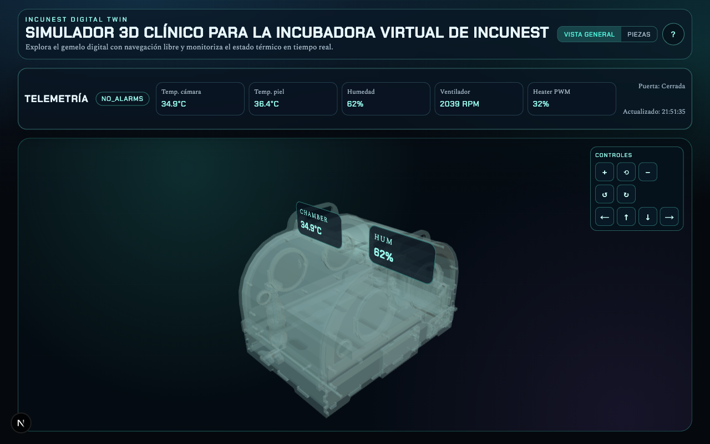
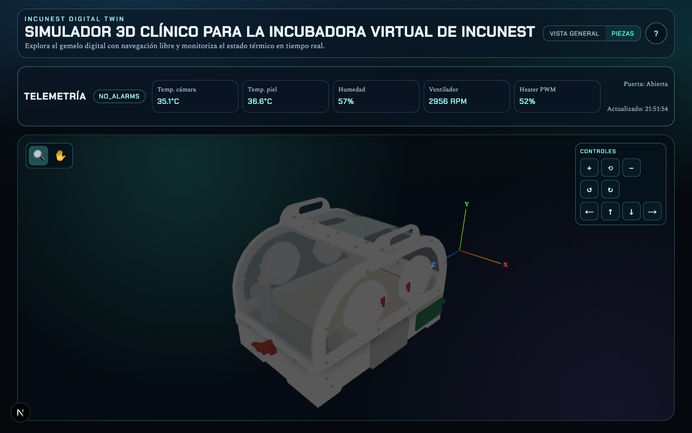
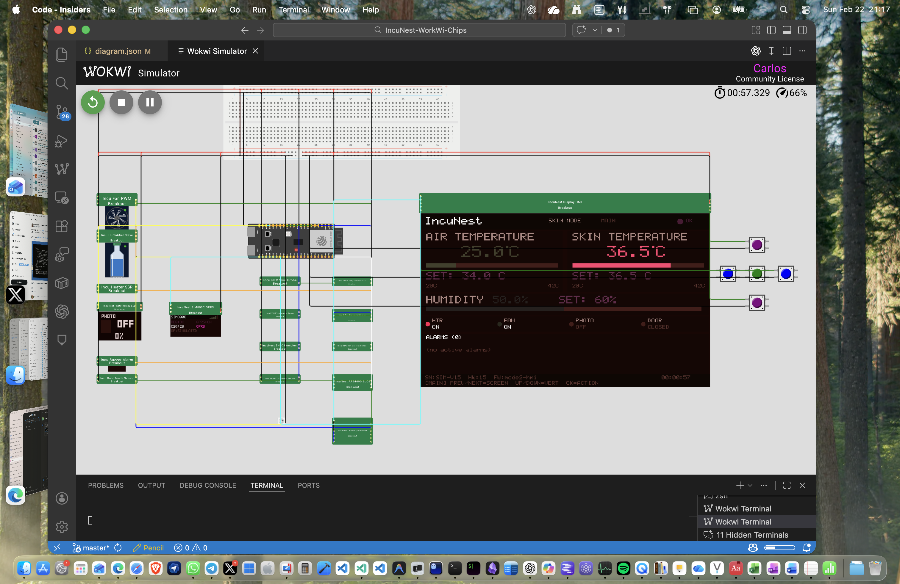

# IncuNest Wokwi Chips

Mono-repo para simular IncuNest en Wokwi con custom chips, ejemplos y visor 3D.

## Visor 3D

### Vista general — Gemelo digital con telemetría en tiempo real


### Vista de piezas — 49 piezas interactivas con modos lupa y mano


## Estructura

- `chips/`: modelos de sensores y actuadores (Wokwi Chips API en C)
  - `include/`: headers compartidos (modelos térmicos, tablas NTC)
- `examples/`: diagramas Wokwi listos para simular (v14 + v15)
- `viewer-3d/`: app Next.js para visualizar el ensamblaje 3D
- `docs/`: documentación consolidada (ver [docs/README.md](docs/README.md))
- `tools/`: scripts de build, validación y bridge
- `Incunest_v15/`: firmware y BOM del hardware upstream

## Ejemplos recomendados

- [v15 base (mode2)](examples/full-incubator-demo-v15/README.md)

## Validación rápida

```bash
node tools/validate-configs.mjs
```

## Generación de binarios de chips

### Docker (recomendado — multiplataforma)

```bash
# Recompilación completa (fuerza rebuild de todos los chips):
docker run --rm -v "$PWD/chips:/src" wokwi/builder-clang-wasm:latest make -B

# Compilación incremental (solo chips modificados):
docker run --rm -v "$PWD/chips:/src" wokwi/builder-clang-wasm:latest make
```

### Script auxiliar (autodetecta toolchain)

```bash
./tools/build-chips.sh          # incremental
./tools/build-chips.sh -B       # full rebuild
```

El script busca en orden: Docker → LLVM nativo → wokwi-cli.

### Sin Docker (fallback nativo)

<details>
<summary>macOS (Homebrew)</summary>

```bash
brew install llvm wasi-libc
make -C chips CC=/opt/homebrew/opt/llvm/bin/clang \
     WASI_SYSROOT=/opt/homebrew/opt/wasi-libc/share/wasi-sysroot \
     EXTRA_FLAGS="-nodefaultlibs -lc" -B
```

> ⚠️ Apple clang no soporta target `wasm32`. Se requiere Homebrew LLVM.
</details>

<details>
<summary>Linux</summary>

```bash
sudo apt install lld clang wasi-libc
make -C chips WASI_SYSROOT=/usr/share/wasi-sysroot -B
```
</details>

## Generación del modelo GLB para el visor 3D

```bash
python3 -m pip install --user cadquery trimesh numpy
python3 tools/convert-step-to-glb.py \
  --input Incunest_v15/Mechanical/IN3_structure_v15.step \
  --output viewer-3d/public/models/incubator.glb
```

## Uso con VS Code + Wokwi

1. Abre `examples/full-incubator-demo/` en VS Code.
2. Instala y activa la extensión Wokwi.
3. Ejecuta `./tools/build-chips.sh -B` para compilar los `.chip.wasm` (requiere Docker o LLVM nativo).
4. Ejecuta `Wokwi: Start Simulator`.

### Captura Wokwi (VS Code Insiders)



> **Disposición manual:** La posición de los componentes en `diagram.json` (`top`, `left`) se establece siempre de forma manual. Wokwi no tiene auto-layout; al añadir o mover partes, ajustar coordenadas revisando el resultado en el simulador.
